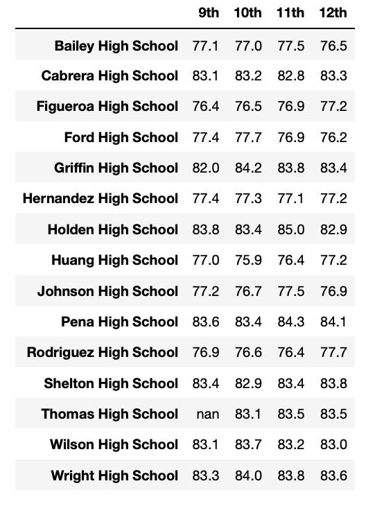

# School District Analysis
## Overview of Project
* The purpose of this project was to analyze the Math and Reading scores of students in this school district, to help inform school district budgets for next year. 
* I looked at the data to see how many students were passing math, reading or both, by school, by grade, by type of school, and by per capita spending.  
* It was then found that the 9th grade scores for one of the schools in the dataset were void, so I then completed the same analysis again with those scored voided out and compared my results
## Results
### District Summary
* Once the Math and Reading scores for the 9th graders at Thomas High School were replace with "NaN" values ("not a number"), I compared the District Summary before and after.
* These scores did not make much of an impact on the district's overall statistics.  
* Total Schools, Total Students, and Total Budget, Average Reading Score stayed the same.
* The only changes were:
  * The Average Math Score dropped slighty from 79.0 to 78.9
  * The % of Students Passing Math dropped slighty from 75.0 t0 74.8
  * The % of Students Passing Reading dropped slighty from 85.8 to 85.7
  * The % of Students Passing Overall dropped slighty from 65.2 to 64.9
* Below is an image of the district summary after the 9th grade scores in question were replaced.

### School Summary
* The School Summary for Thomas High School is the only one that was affected, because it was the only school that had to have scores replaced.
* I created 2 versions of the school summary for Thomas High School
 * The original with all data
 * One with the 9th grade scores as NaN which show the 10-12th grade results
* The Scores varied slightly between each Data Frame.  
 * Average Math Score:
   * Did not change overall the value was 83.4
 * Average Reading Score:
   * Original Data: 83.8
   * 9th Grade as "NaN": 83.9
 * % Passing Math: 
   * Original Data: 93.3
   * 9th Grade as "NaN": 93.2
 * % Passing Reading:
   * Original Data: 97.3
   * 9th Grade as "NaN: 97.0
 * % Overall Passing:
   * Original Data: 90.9
   * 9th Grade as "NaN": 90.6
* Overall the 9th grade scores did not have that much of an affect overall on the results from Thomas High School.  The biggest changes in the data were only 0.3% less students passed reading and passed overall.
* Below is an image of the Data Frame with a summary of each school in the dataset with the 9th grade scores replaced as "NaN" for Thomas High School.

### Scores by Grade by School
 * For this analysis, I looked at the students scores by grade, by school for both math and reading.
 * Having the 9th grade scores as "NaN" for Thomas High School, didn't affect the scores in my analysis, there were just no scores for 9th graders at Thomas High School.
 * Below is a photo of the Data Frame I created for math scores by school by grade (the same type of Data Frame was also created for reading scores).
 * Just note that the scores for 9th grade at Thomas High School have been replaced with nan
 
 
 

### Scores by School Spending
 * I group the schools into 4 different spending bin groups based on the amount of money they spent per student. 
 * I found that even with the 9th grade THS scores as NaN the metrics, this did not change the outcome.  The values stayed the same as the original data.
 * It was interesting because my findings showed that the schools that spent the least amount per student had the highest rate of overall students passing.
 * Below is my Data Frame with my findings.

### Scores by School Size
 * I also analyzed the data to see the rate of students passing by school size.
 * Similar to the scores by school spending, having the 9th grade scores from THS as NaN had no affect on the outcomes I found here
 * In my findings, Large schools (2000-5000 students) had significantly lower overall passing rates than Small and Medium Schools
 * Large schools had an overall passing rate of 58% while Small schools had 90% and Medium schools had 91%
 * There was little variance in the rates between Small and Medium Schools, they vaired by at most 1%
 * Below is an image of my Data Frame with my findings:
 
 
 

  

 
